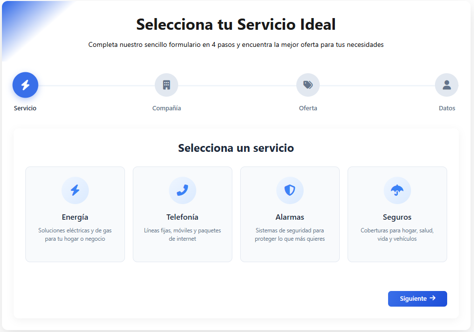

 #  Módulo Formulario Multistep - WordPress + Contact Form 7

Este proyecto es un **formulario interactivo en múltiples pasos (multi-step form)** desarrollado en **HTML, CSS y JavaScript**.  
Está diseñado para insertarse manualmente en una web con **WordPress**, integrándose con la **API REST** y el plugin **Contact Form 7** para el envío de propuestas personalizadas.  

---

---

##  Características

- 🔹 **Flujo en 4 pasos**: selección de servicio, compañía, oferta y datos de contacto.  
- 🔹 **Diseño responsivo** optimizado para desktop y móvil.  
- 🔹 **Validaciones dinámicas** paso a paso.  
- 🔹 **Resúmenes en tiempo real** de la selección del cliente antes de enviar.  
- 🔹 **Integración con Contact Form 7** para envío de datos al correo o CRM.  
- 🔹 Uso de **Font Awesome** para iconografía.  

---

##  Tecnologías utilizadas

- **HTML5 + CSS3** – Maquetación y estilos avanzados.  
- **JavaScript (vanilla)** – Lógica de pasos, validaciones y dinámicas.  
- **Font Awesome 5** – Iconografía para los pasos y opciones.  
- **WordPress REST API** – Envío y gestión de propuestas.  
- **Contact Form 7** – Plugin de WordPress para recibir los datos del formulario.  

---

##  Instalación e integración

1. **Copia el código** del formulario (`HTML`, `CSS` y `JavaScript`) en tu plantilla o en un bloque HTML personalizado de WordPress.  

2. Asegúrate de tener instalado y configurado **Contact Form 7** en tu sitio WordPress.  

3. Edita el formulario de Contact Form 7 y agrega los campos necesarios (nombre, email, teléfono, etc.), asegurando que coincidan con los `name` del formulario (`name`, `email`, `phone`, `message`, etc.).  

4. Integra el script para que los datos se envíen mediante la API REST de WordPress.  

5. Personaliza el **mapeo de servicios, compañías y ofertas** en el archivo JS según tus necesidades:  
   - Servicios: Energía, Telefonía, Alarmas, Seguros.  
   - Compañías: Iberdrola, Vodafone, Movistar, etc.  
   - Ofertas: Fibra, Fibra + Línea, Hogar, Negocio, etc.  

---

##  Vista previa

🔹 **Selección de servicio (paso 1)**  
Formulario inicial con servicios destacados (energía, telefonía, alarmas, seguros).  

🔹 **Selección de compañía (paso 2)**  
Opciones dinámicas en base al servicio elegido.  

🔹 **Selección de oferta (paso 3)**  
Paquetes y ofertas específicas por sector.  

🔹 **Formulario de contacto + Resumen (paso 4)**  
El usuario completa sus datos y ve el resumen antes de enviar.  

---

##  Flujo del usuario

1. El cliente selecciona **servicio → compañía → oferta**.  
2. Revisa un **resumen dinámico** con sus elecciones.  
3. Completa sus **datos de contacto**.  
4. La información se envía al **plugin Contact Form 7** mediante la **API REST**.  

---

##  Estado del proyecto

Proyecto funcional y listo para integrarse en entornos **WordPress**.  
Actualmente está diseñado como **módulo independiente** para ser insertado en cualquier web manualmente.  

---

📅 Proyecto educativo / demostración en **WordPress + Contact Form 7**

